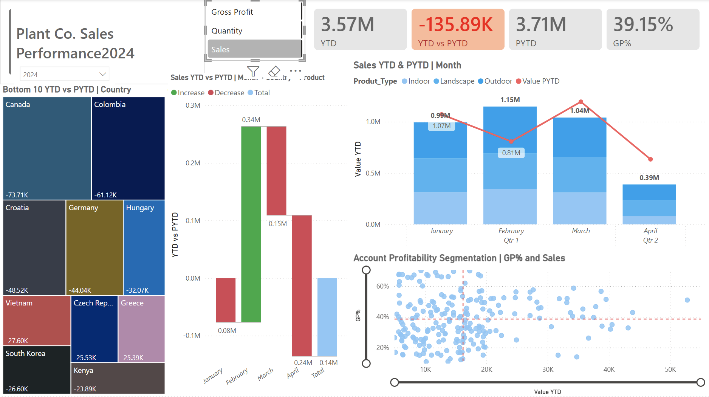
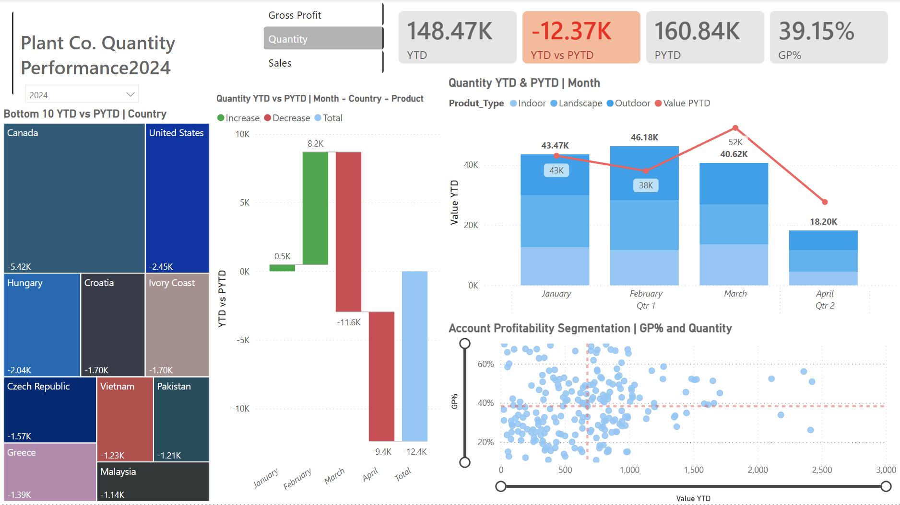
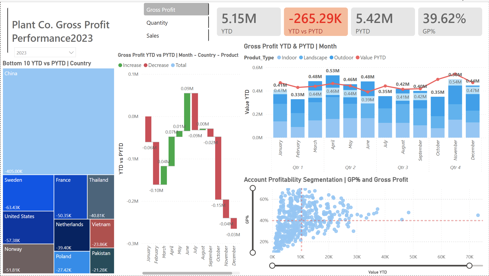
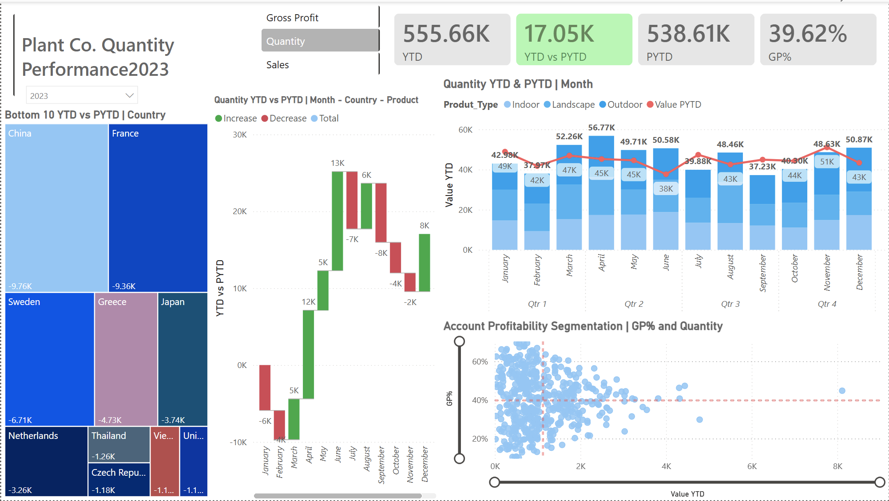
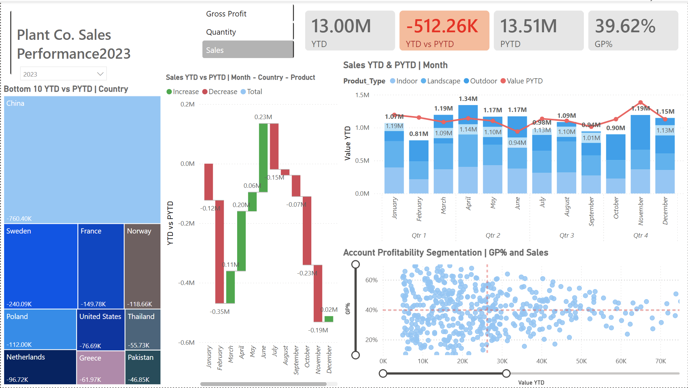
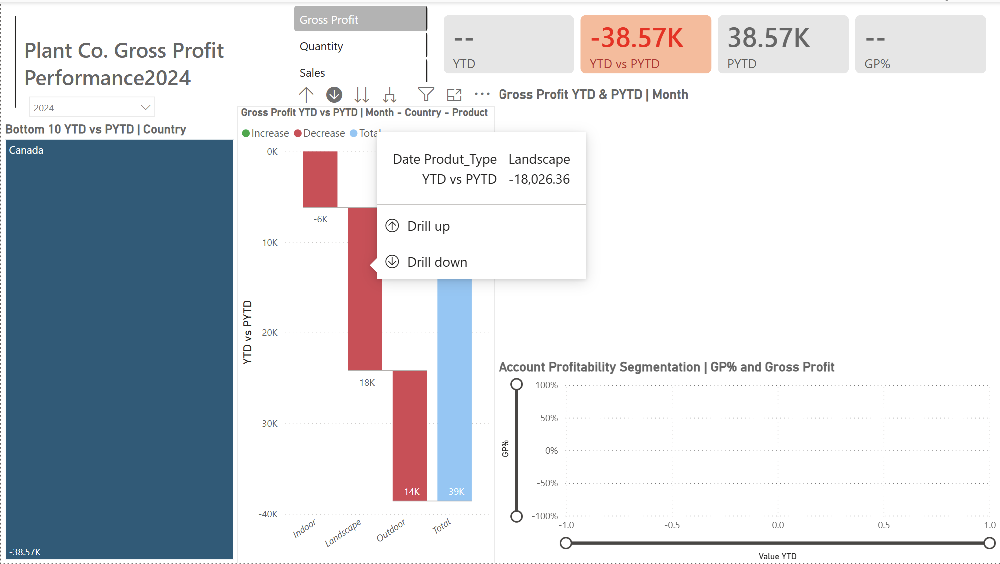
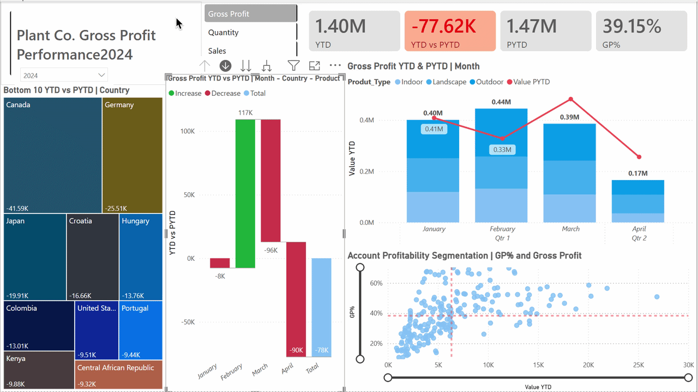

# Power BI Plant Performance Dashboard
Power BI dashboard analyzing **Sales, Quantity, and Gross Profit performance using YTD vs PYTD analysis with interactive drill-down capabilities.**
This project presents an interactive Power BI dashboard designed to analyze business performance across **Sales, Quantity, and Gross Profit** metrics.

The dashboard compares **Year-to-Date (YTD)** performance against **Previous Year-to-Date (PYTD)** to identify performance trends, monthly drivers of change, and key contributors to profit gains or losses.

Through interactive visuals and drill-down capabilities, the report enables deeper analysis across:

- Monthly performance trends
- Geographic performance by country
- Product category contributions
- Customer account profitability

---

## Tools Used

- **Power BI** for dashboard development and data visualization
- **Power Query** for data preparation and transformation
- **DAX (Data Analysis Expressions)** for calculated measures and time-intelligence analysis
- **Data Modeling** to connect fact and dimension tables
- **Interactive Visual Design** for slicers, drill-downs, and dynamic metric switching

---

## Dataset

The dataset contains transactional sales data for a plant products company along with supporting dimension tables.

Key tables used in the project include:

- **Fact_Sales** – transactional sales data including revenue, quantity sold, and cost of goods
- **Plant_Hierarchy** – product classification including product type and category
- **Accounts** – customer account and geographic information
- **Date Dimension** – used for time intelligence calculations

This structure allows the dashboard to analyze performance across time, geography, product types, and customer accounts.

---

# Dashboard Overview

The dashboard allows users to dynamically switch between **Sales, Quantity, and Gross Profit** metrics while comparing **YTD performance to PYTD performance**.

The report contains several analytical components:

- KPI summary cards for YTD vs PYTD comparison
- Waterfall charts identifying performance drivers
- Geographic performance analysis by country
- Product category analysis
- Customer profitability segmentation
- Interactive drill-down capabilities

---

# Dashboard Visualizations

## Gross Profit Dashboard (2024)


This view focuses on **Gross Profit performance in 2024** compared to the previous year.

The dashboard highlights performance changes by:

- Month
- Country
- Product Type
- Customer Accounts

---

## Sales Dashboard (2024)



This view analyzes **Sales performance trends** and allows users to evaluate revenue growth or decline across different regions and product categories.

---

## Quantity Dashboard (2024)



This section examines **sales volume trends**, allowing comparison between units sold across different markets and product segments.

---

# Historical Comparison (2023 Performance)

## Gross Profit Performance (2023)



## Quantity Performance (2023)



## Sales Performance (2023)



These views provide baseline performance for comparison with the 2024 analysis.

---

# Key Business Insights

## February Performance Peak

February 2024 recorded the strongest gross profit performance and **exceeded the same period in the previous year**.

- **2024:** 0.44M  
- **2023:** 0.33M  

This indicates strong early-year performance before the later decline.

---

## Gross Profit Decline (March–April 2024)

Later months show a noticeable decline in gross profit when compared to the previous year.

The **waterfall chart** highlights the monthly drivers of this negative variance.


---

## Geographic Driver of Decline

Analysis of the treemap reveals that **Canada contributed the largest share of the decline in gross profit**.


---

## Product Category Impact

Drill-down analysis reveals that the decline was largely driven by **Landscaping products**.



---

# Interactive Drill-Down Analysis

The dashboard allows users to drill from overall performance into deeper levels of analysis.

This example demonstrates how the gross profit decline can be traced from:

**Total Performance → Country → Product Type**



This interactive capability allows analysts to quickly identify the drivers behind performance changes.

---

# Key DAX Measures

## Base Measures

```DAX
Sales = SUM(Fact_sales[Sales_USD])

Quantity = SUM(Fact_sales[quantity])

COGs = SUM(Fact_sales[COGS_USD])

Gross Profit = [Sales] - [COGs]

GP% = DIVIDE([Gross Profit], [Sales])
```

---

## Year-To-Date Measures

```DAX
YTD_Sales = TOTALYTD([Sales], Fact_sales[Date_Time])

YTD_Quantity = TOTALYTD([Quantity], Fact_sales[Date_Time])

YTD_GrossProfit = TOTALYTD([Gross Profit], Fact_sales[Date_Time])
```

---

## Previous Year-To-Date Measures

```DAX
PYTD_Sales =
CALCULATE(
    [Sales],
    SAMEPERIODLASTYEAR(Dim_Date[Date]),
    Dim_Date[Inpast] = TRUE()
)

PYTD_Quantity =
CALCULATE(
    [Quantity],
    SAMEPERIODLASTYEAR(Dim_Date[Date]),
    Dim_Date[Inpast] = TRUE()
)

PYTD_GrossProfit =
CALCULATE(
    [Gross Profit],
    SAMEPERIODLASTYEAR(Dim_Date[Date]),
    Dim_Date[Inpast] = TRUE()
)
```

---

## Metric Switching Logic

These measures allow the dashboard visuals to dynamically change depending on the metric selected by the user.

```DAX
S_YTD =
VAR selected_value = SELECTEDVALUE(Slc_values[Values])
RETURN
SWITCH(
    selected_value,
    "Sales", [YTD_Sales],
    "quantity", [YTD_Quantity],
    "Gross Profit", [YTD_GrossProfit],
    BLANK()
)

S_PYTD =
VAR selected_value = SELECTEDVALUE(Slc_values[Values])
RETURN
SWITCH(
    selected_value,
    "Sales", [PYTD_Sales],
    "quantity", [PYTD_Quantity],
    "Gross Profit", [PYTD_GrossProfit],
    BLANK()
)

YTD vs PYTD = [S_YTD] - [S_PYTD]
```

---

# Project Purpose

This project was completed as a **hands-on Power BI learning exercise** focused on developing skills in:

- Data modeling
- DAX time-intelligence calculations
- Interactive dashboard design
- Business performance analysis
- Data storytelling

The goal was to practice translating raw transactional data into actionable insights through visual analytics.
